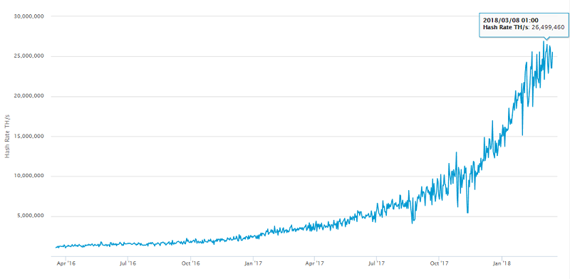

# Mining, Mining, Mining

What's your hash rate? Let's find out.
Let's use a "stand-alone" version of the by now "classic" `compute_hash_with_proof_of_work`
function:

``` ruby
require 'digest'

def compute_hash_with_proof_of_work( data, difficulty='00' )
  nonce = 0
  loop do
    hash = Digest::SHA256.hexdigest( "#{nonce}#{data}" )
    if hash.start_with?( difficulty )
      return [nonce,hash]    ## bingo! proof of work if hash starts with leading zeros (00)
    else
      nonce += 1             ## keep trying (and trying and trying)
    end
  end # loop
end # method compute_hash_with_proof_of_work
```

Let's try (run) benchmarks for the difficulty from `0` (4 bits)
to `0000000` (28 bits).
Remember: `0` in hex (base16, 2^4 bits) equals `0000` in binary (base2),
thus, `0000000` in hex (base16) equals `0` x 4 x 7 = 28 zero bits
in binary (base2).  Example:

``` ruby
(1..7).each do |factor|
   difficulty = '0' * factor
   puts "difficulty: #{difficulty} (#{difficulty.length*4} bits)"
end

# => difficulty: 0 (4 bits)
#    difficulty: 00 (8 bits)
#    difficulty: 000 (12 bits)
#    difficulty: 0000 (16 bits)
#    difficulty: 00000 (20 bits)
#    difficulty: 000000 (24 bits)
#    difficulty: 0000000 (28 bits)
```

Let's add the hash proof-of-work hash computing
machinery and re(run):

``` ruby
(1..7).each do |factor|
   difficulty = '0' * factor
   puts "Difficulty: #{difficulty} (#{difficulty.length*4} bits)"

   puts "Starting search..."
   t1 = Time.now
   nonce, hash = compute_hash_with_proof_of_work( 'Hello, Cryptos!', difficulty )
   t2 = Time.now

   delta = t2 - t1
   puts "Elapsed Time: %.4f seconds, Hashes Calculated: %d" % [delta,nonce]

   if delta > 0
     hashrate = Float( nonce / delta )
     puts "Hash Rate: %d hashes per second" % hashrate
   end
   puts
end
```

Resulting on a "low-end" home computer:

```
Difficulty: 0 (4 bits)
Starting search...
Elapsed Time: 0.0156 seconds, Hashes Calculated: 56
Hash Rate: 3 588 hashes per second

Difficulty: 00 (8 bits)
Starting search...
Elapsed Time: 0.0000 seconds, Hashes Calculated: 143
Hash Rate: Infinity ;-)

Difficulty: 000 (12 bits)
Starting search...
Elapsed Time: 0.0313 seconds, Hashes Calculated: 3 834
Hash Rate: 122 684 hashes per second

Difficulty: 0000 (16 bits)
Starting search...
Elapsed Time: 0.2656 seconds, Hashes Calculated: 26 762
Hash Rate: 100 753 hashes per second

Difficulty: 00000 (20 bits)
Starting search...
Elapsed Time: 1.2031 seconds, Hashes Calculated: 118 592
Hash Rate: 98 569 hashes per second

Difficulty: 000000 (24 bits)
Starting search...
Elapsed Time: 220.5767 seconds, Hashes Calculated: 21 554 046
Hash Rate: 97 716 hashes per second

Difficulty: 0000000 (28 bits)
Starting search...
```

To sum up the hash rate is about 100 000 hashes per second
on a "low-end" home computer. What's your hash rate?
Run the benchmark on your machinery!

The search for the 28 bits difficulty proof-of-work hash
is still running... expected to find the lucky number in the next hours...  


Trivia Quiz: What's the Hash Rate of the Bitcoin Classic Network?

A: About 25 million trillions of hashes per second (in March 2018)

Estimated number of tera hashes per second (trillions of hashes per second)
the Bitcoin network is performing.



(Source: [blockchain.info](https://blockchain.info/charts/hash-rate))


**BEWARE: Bitcoin is a gigantic ponzi scheme¹.
To the moon!? The new gold standard!? 
Do NOT "invest" trying to get-rich-quick HODLing. 
Why not? The bitcoin code is archaic and out-of-date.
Burn, baby, burn! Proof-of-work / waste is a global
energy environmental disaster
using 300 kW/h per bitcoin transaction (!) that's about 179 kilograms of CO₂ emissions².
Programmable money (or the internet of value) 
for all future generations with (bitcoin) script
without loops and jumps (gotos) and all "stateless"!? LOL.**

¹:  

(Source: [Best of Bitcoin Maximalist - Scammers, Morons, Clowns, Shills & BagHODLers - Inside The New New Crypto Ponzi Economics](https://bitsblocks.github.io/bitcoin-maximalist))

²: Assuming let's say 0.596 kilograms of CO₂ per kW/h 
(that's the energy efficiency in Germany) that's 
about 179 kilograms of CO₂ per bitcoin transaction (300 kW/h × 0.596 kg). For more insights see the [Bitcoin Energy Consumption Index](https://digiconomist.net/bitcoin-energy-consumption).
